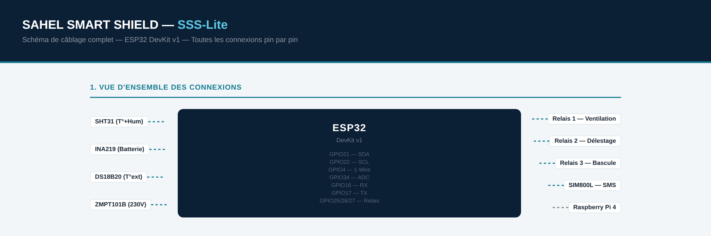
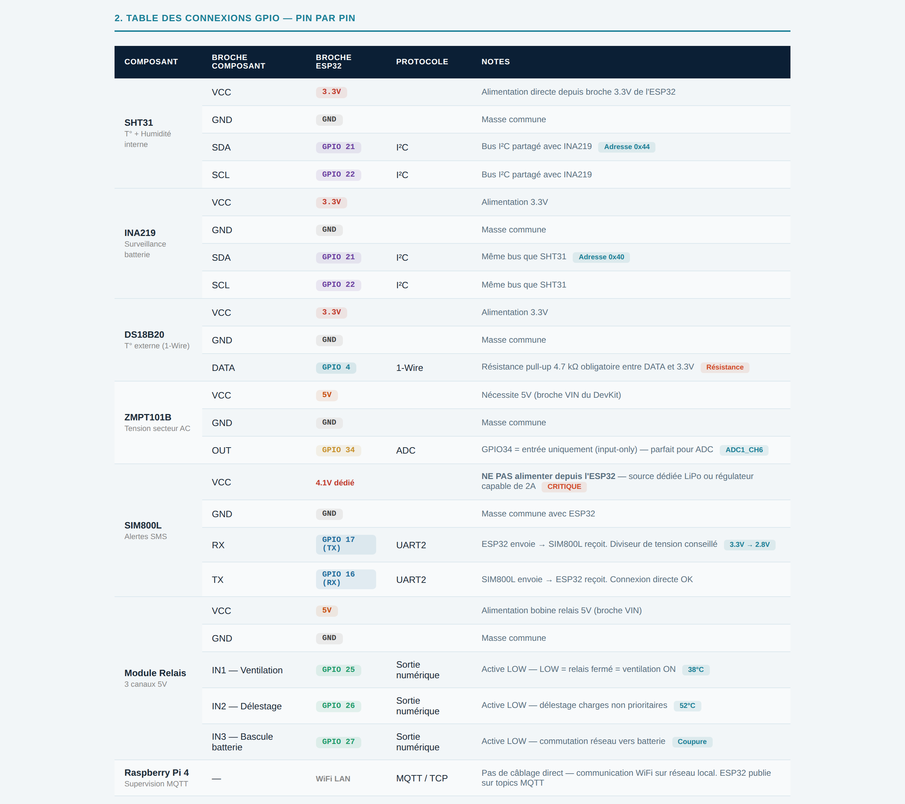

# SAHEL SMART SHIELD

**Système de surveillance thermique et de protection énergétique des armoires techniques critiques du Sahel**

*An autonomous embedded monitoring system that protects critical technical cabinets in the Sahel: it tracks temperature, humidity, mains presence and battery charge, triggers automatic protections and sends SMS alerts — with no internet connection and no remote server. Firmware in C++ (ESP32) and in Structured Text IEC 61131-3 (Siemens LOGO!). Documentation in French.*

---

Dans le Sahel, les équipements critiques tombent en panne non pas à cause d'un problème soudain, mais parce que personne ne surveille les signaux qui précèdent la panne. La température monte progressivement, le réseau électrique devient instable, la batterie se décharge silencieusement — et quand on s'en aperçoit, il est trop tard.

SAHEL SMART SHIELD est un système embarqué autonome qui surveille en permanence l'état d'une armoire technique, détecte ces signaux, déclenche des protections automatiques et alerte le technicien responsable par SMS — sans connexion internet, sans serveur distant, sans dépendance à une infrastructure numérique.

> **État du projet.** Le firmware SSS-Lite (ESP32) et le programme SSS-Pro (Structured Text) sont écrits et documentés. Le plan de tests est rédigé mais **n'a pas encore été exécuté sur matériel réel**. La supervision Raspberry Pi est spécifiée mais pas encore implémentée.

---

## Deux versions

| | SSS-Lite | SSS-Pro |
|---|---|---|
| **Contrôleur** | ESP32 DevKit v1 | Siemens LOGO! 12/24RC |
| **Langage** | C++ (PlatformIO) | Structured Text IEC 61131-3 |
| **Montage** | Breadboard / boîtier DIY | Rail DIN industriel |
| **Cible** | Dispensaires, écoles, solaire rural | Hôpitaux, télécoms, pompage |
| **Coût matériel** | ~312 € | ~750 € |
| **Statut** | Firmware écrit, tests à réaliser | Programme écrit, non déployé |

---

## Ce que le système fait

**5 grandeurs mesurées en continu**
- Température interne de l'armoire (SHT31)
- Température externe ambiante (DS18B20)
- Humidité relative — risque de condensation (SHT31)
- Présence ou absence du réseau secteur 230 V (ZMPT101B)
- Niveau de charge de la batterie de secours (INA219)

**7 états de protection automatique**

La machine à états est implémentée dans `sss_logic.h` avec une hystérésis pour éviter les oscillations autour des seuils.

| État | Seuil | Action |
|---|---|---|
| NORMAL | < 38 °C | Surveillance continue |
| CHAUD | ≥ 38 °C | Ventilation forcée activée |
| ALERTE | ≥ 45 °C | SMS d'alerte au technicien |
| CRITIQUE | ≥ 52 °C | Délestage des charges non prioritaires |
| COUPURE | Secteur absent | Bascule automatique sur batterie |
| URGENCE | Batterie < 20 % | SMS d'urgence + délestage supplémentaire |
| RETOUR | Secteur rétabli | Reprise normale + recharge batterie |

**Fonctionnement sans réseau**

Le firmware publie ses mesures et son état en MQTT lorsqu'un réseau local est disponible. En l'absence de Wi-Fi, il bascule en mode autonome : la logique de protection et les alertes SMS continuent de fonctionner sans dégradation.

---

## Schéma de câblage — SSS-Lite



**Table des connexions GPIO, pin par pin**



Schémas complets, avec l'architecture d'alimentation et les composants passifs requis :
[SSS-Lite](hardware/img/schema_cablage_lite.png) · [SSS-Pro](hardware/img/schema_cablage_pro.png)
Les sources HTML se trouvent dans [`hardware/`](hardware/).

> Le SIM800L requiert une alimentation dédiée capable de fournir 2 A en pic. Ne pas l'alimenter depuis la broche 3.3 V de l'ESP32.

---

## Structure du projet

```
sahel-smart-shield/
├── firmware/
│   ├── sss-firmware/               # SSS-Lite — ESP32, C++
│   │   ├── src/
│   │   │   ├── main.cpp            # Point d'entrée, Wi-Fi, MQTT, relais, SMS
│   │   │   ├── sss_config.h        # Constantes : GPIO, seuils, MQTT, temporisations
│   │   │   ├── sss_logic.h         # Machine à états — 7 niveaux, avec hystérésis
│   │   │   └── sss_sensors.h       # Lecture et filtrage des capteurs
│   │   └── platformio.ini
│   └── sss-pro/                    # SSS-Pro — Siemens LOGO!, Structured Text
│       └── src/
│           ├── sss_main_pro.st     # Programme principal IEC 61131-3
│           └── sss_config_pro.st   # Constantes et déclarations de variables
├── hardware/
│   ├── SSS_Schema_Cablage_Lite.html
│   ├── SSS_Schema_Cablage_Pro.html
│   └── img/                        # Schémas exportés en PNG pour ce README
├── tests/
│   └── plan_de_tests.md            # Plan de validation formel — non encore exécuté
├── LICENSE
└── README.md
```

---

## Matériel requis (SSS-Lite)

| Composant | Référence | Quantité | Rôle |
|---|---|---|---|
| Microcontrôleur | ESP32 DevKit v1 | 1 | Cerveau du système |
| Capteur T° + Humidité | SHT31-D | 1 | Température + humidité interne |
| Sonde T° externe | DS18B20 (étanche) | 1 | Température ambiante |
| Capteur tension AC | ZMPT101B | 1 | Présence secteur 230 V |
| Capteur batterie | INA219 | 1 | Niveau de charge |
| Module GSM | SIM800L | 1 | Alertes SMS |
| Module relais | 5 V 3 canaux | 1 | Ventilation, délestage, bascule |
| Supervision | Raspberry Pi 4 (2 Go) | 1 | MQTT, Node-RED, SQLite |
| Résistance pull-up | 4,7 kΩ | 3 | DS18B20 + I²C |
| Condensateur | 1000 µF / 10 V | 1 | Filtrage alimentation SIM800L |
| Batterie secours | 12 V 7 Ah VRLA | 1 | Continuité énergétique |
| Alimentation SIM800L | Buck 4,1 V / 2 A min | 1 | Source dédiée obligatoire |

---

## Câblage GPIO (résumé)

| GPIO | Rôle | Composant |
|---|---|---|
| GPIO 4 | 1-Wire DATA | DS18B20 |
| GPIO 21 (SDA) | I²C Data | SHT31 + INA219 |
| GPIO 22 (SCL) | I²C Clock | SHT31 + INA219 |
| GPIO 34 | ADC entrée | ZMPT101B |
| GPIO 16 (RX) | UART2 | SIM800L TX |
| GPIO 17 (TX) | UART2 | SIM800L RX |
| GPIO 25 | Relais 1 | Ventilation |
| GPIO 26 | Relais 2 | Délestage |
| GPIO 27 | Relais 3 | Bascule batterie |

---

## Installation et configuration

### Prérequis logiciels

- [Visual Studio Code](https://code.visualstudio.com/)
- Extension [PlatformIO IDE](https://platformio.org/)
- Bibliothèques (déclarées dans `platformio.ini`) :
  - `adafruit/Adafruit SHT31 Library`
  - `paulstoffregen/OneWire`
  - `milesburton/DallasTemperature`
  - `wollewald/INA219_WE`
  - `knolleary/PubSubClient` (MQTT)

### Cloner le projet

```bash
git clone https://github.com/SerenaPTD/sahel-smart-shield.git
cd sahel-smart-shield/firmware/sss-firmware
```

### Configurer

Ouvrir `src/sss_config.h` et renseigner :

```cpp
#define WIFI_SSID         "nom_du_reseau"
#define WIFI_PASSWORD     "mot_de_passe"
#define MQTT_BROKER_IP    "192.168.x.x"     // IP du Raspberry Pi
#define TEL_TECHNICIEN    "+23566XXXXXXX"   // Numéro d'alerte SMS
```

### Compiler et flasher

Dans VS Code avec PlatformIO :

1. Brancher l'ESP32 en USB
2. Cliquer sur ✓ (Build) puis → (Upload) dans la barre PlatformIO
3. Ouvrir le moniteur série (115200 bauds) pour vérifier le démarrage

---

## Feuille de route

- [x] Phase 00 — Cadrage et cahier des charges
- [x] Phase 01 — Architecture technique et schémas de câblage
- [x] Phase 02 — Firmware ESP32 et programme Structured Text
- [ ] Phase 03 — Exécution du plan de tests sur matériel
- [ ] Phase 04 — Supervision Raspberry Pi (Mosquitto, Node-RED, SQLite)
- [ ] Phase 05 — Déploiement pilote SSS-Pro au Tchad
- [ ] Phase 06 — Évaluation et extension multi-sites

---

## Licence

MIT — libre d'utilisation, de modification et de redistribution.

---

*SAHEL SMART SHIELD — [github.com/SerenaPTD/sahel-smart-shield](https://github.com/SerenaPTD/sahel-smart-shield)*
